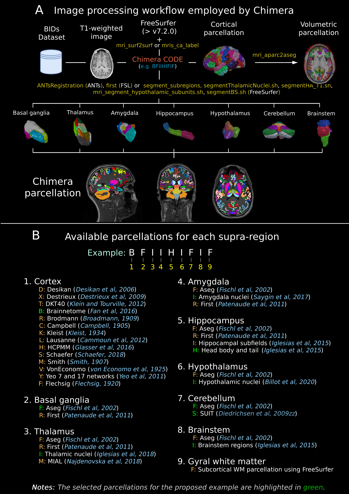
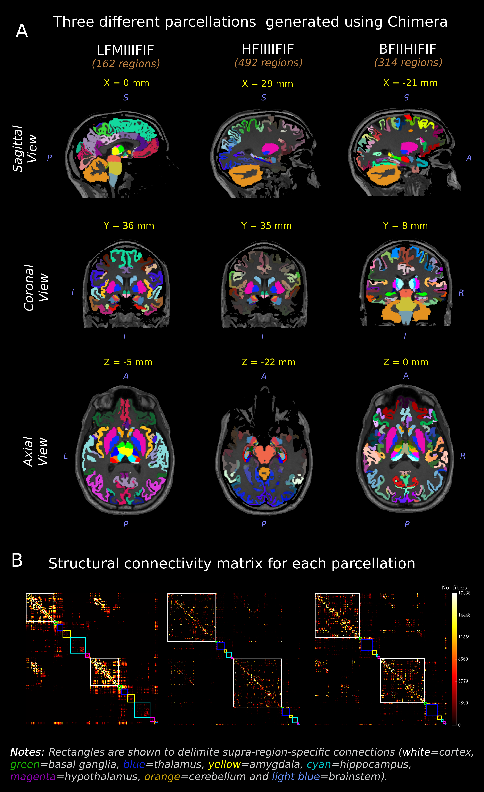

# **CHIMERA**: An open source framework for combining multiple parcellations

<p align="justify">
Creating multi-source parcellations of the human brain is a fundamental task at several steps of the MRI analysis research workflow. <b>Chimera</b> facilitates this otherwise difficult operation with an intuitive and flexible interface for humans and machines, thereby assisting in the construction of sophisticated and more reliable processing pipelines.
This repository contains the source code and atlases needed by <b>Chimera</b>.
</p>

## 📖 Documentation

Full documentation is available at: **[https://chimera-brainparcellation.readthedocs.io](https://chimera-brainparcellation.readthedocs.io)**

The documentation includes:
- Complete API reference
- Installation guide  
- Usage examples
- Parcellation methodology details

### Parcellations fusion

<p align="justify">
Chimera defines ten different supra-regions (cortex, basal ganglia, thalamus, amygdala, hippocampus, hypothalamus, cerebellum, brainstem, gyral white matter, and white-matter). Basal ganglia includes only the regions that are not labeled as supra-regions. Subdivisions in each supra-region will be populated with the parcellation information of a single source. The available parcellation sources per supra-region, as well as one corresponding parcellation name, and a one-character unique identifier are configured in a JSON (JavaScript Object Notation) file. <br>
<b>Chimera code</b>: A sequence of ten one-character identifiers (one per each supra-region) unambiguosly denotes a single instance of combined parcellation (Figure. 1B). Given the sequence of ten identifier characters, Chimera selects the atlas and/or applies the corresponding methodology to obtain the parcellation for each supra-region. These supra-region-specific parcellations are finally integrated to obtain the combined volumetric parcellation for each input subject, as well as its corresponding tab-separated values table of labels, region names, and rendering colors for visualization.
Chimera uses FreeSurfer to map cortical templates from fsaverage to individual space. It also applies different methods to obtain the hippocampal subfields and brainstem parcellations as well as the thalamic, amygdala and hypothalamic nuclei segmentations. FIRST and ANTs are also used for segmenting subcortical structures and thalamic nuclei respectively.
</p>



### Requirements

Required Python Packages

#### Standard Library (Built-in, no installation required)

- [argparse](https://docs.python.org/3/library/argparse.html) - Command-line argument parsing
- [csv](https://docs.python.org/3/library/csv.html) - CSV file reading and writing
- [datetime](https://docs.python.org/3/library/datetime.html) - Date and time handling
- [json](https://docs.python.org/3/library/json.html) - JSON encoder and decoder
- [operator](https://docs.python.org/3/library/operator.html) - Standard operators as functions
- [os](https://docs.python.org/3/library/os.html) - Operating system interface
- [pathlib](https://docs.python.org/3/library/pathlib.html) - Object-oriented filesystem paths
- [shutil](https://docs.python.org/3/library/shutil.html) - High-level file operations
- [subprocess](https://docs.python.org/3/library/subprocess.html) - Subprocess management
- [sys](https://docs.python.org/3/library/sys.html) - System-specific parameters and functions
- [time](https://docs.python.org/3/library/time.html) - Time access and conversions
- [typing](https://docs.python.org/3/library/typing.html) - Support for type hints

## Data Science & Analysis

- [numpy](https://pypi.org/project/numpy/) - Fundamental package for scientific computing
- [pandas](https://pypi.org/project/pandas/) - Data manipulation and analysis library
- [scipy](https://pypi.org/project/scipy/) - Scientific computing library

## Neuroimaging & Medical Data

- [nibabel](https://pypi.org/project/nibabel/) - Access to neuroimaging file formats
- [pybids](https://pypi.org/project/pybids/) - BIDS (Brain Imaging Data Structure) toolkit
- [templateflow](https://pypi.org/project/templateflow/) - Neuroimaging template management

## CLI & User Interface

- [rich](https://pypi.org/project/rich/) - Rich text and beautiful formatting for terminals

## Specialized Tools

- [clabtoolkit](https://pypi.org/project/clabtoolkit/) - Connectomics Lab Toolkit

## Installation

### Install from PyPI (Recommended)

The easiest way to install CHIMERA is using pip:

```bash
pip install chimera-brainparcellation
```

This will automatically install all required dependencies including:
- pandas
- pybids  
- numpy
- nibabel
- rich
- scipy
- templateflow
- clabtoolkit
- NB: Clabtoolkit requires the dev version as of 20250916

### Manual Installation

Alternatively, you can install all required external packages manually:

```bash
pip install pandas pybids numpy nibabel rich scipy templateflow clabtoolkit
```

Or using the yaml file:

```bash
conda env create -f environment.yaml -n chimera --solver=libmamba
```
Or on Mac:
```
conda env create -f environment-mac.yaml -n chimera --solver=libmamba
```

### requirements.txt content:

```
pandas
pybids
numpy
nibabel
rich
scipy
templateflow
clabtoolkit
```

Required image processing packages:

- [FreeSurfer (version>7.2.0)], [FSL], [ANTs]

---

### Options:

Brief description of input options:

| Option                   | Description                                                                                                                    |
| ------------------------ | ------------------------------------------------------------------------------------------------------------------------------ |
| `--regions`, `-r`        | List available parcellations for each supra-region.                                                                            |
| `--bidsdir`, `-b`        | BIDs dataset folder. Different BIDs directories could be entered separating them by a comma.                                   |
| `--derivdir`, `-d`       | Derivatives folder. Different directories could be entered separating them by a comma.                                         |
| `--parcodes`, `-p`       | Sequence of ten one-character identifiers (one per each supra-region).                                                         |
| `--freesurferdir`, `-fr` | FreeSurfer subjects dir. If the folder does not exist it will be created.                                                      |
| `--scale`, `-s`          | Scale identification. This option should be supplied for multi-resolution cortical parcellations (e.g. Lausanne or Schaeffer). |
| `--seg`, `-e`            | Segmentation identifier.                                                                                                       |
| `--nthreads`, `-n`       | Number of processes to run in parallel (default= Number of cores - 4).                                                         |
| `--growwm`, `-g`         | Grow of GM labels inside the white matter (mm).                                                                                |
| `--subjids`, `-ids`      | Subject IDs. Multiple subject ids can be specified separating them by a comma.                                                 |
| `--mergectx,`, `-mctx`   | Join cortical white matter and cortical gray matter regions.                                                                   |
| `--force`, `-f`          | Overwrite the results.                                                                                                         |
| `--verbose`, `-v`        | Verbose (**0**, **1** or **2**).                                                                                               |
| `--help`, `-h`           | Help.                                                                                                                          |

---

##### Usage

General command line to use **Chimera**:

```sh
    $ chimera -b <BIDs directory> -d <Derivatives directory> -p <Chimera code>
```

This command will run Chimera for all the subjects in the BIDs directory.

##### Simple examples

1. Running **Chimera** for 3 different parcellation codes (LFMFIIFIF,SFMFIIFIF,CFMFIIFIF). This will obtain the combined parcellations for all the T1-weighted images inside the BIDs dataset.

```sh
    $ chimera -b <BIDs directory> -d <Derivatives directory> -p LFMFIIFIF,SFMFIIFIF,CFMFIIFI
```

2. Running **Chimera** for T1-weighted images included in a txt file:

```sh
    $ chimera -b <BIDs directory> -d <Derivatives directory> -p LFMFIIFIF -ids <t1s.txt>
```

Example of **t1s.txt** file
| sub-00001_ses-0001_run-2
| sub-00001_ses-0003_run-1
| sub-00001_ses-post_acq-mprage

3. Cortical volumes will grow 0 and 2 mm respectively inside the white matter for the selected cortical parcellations.

```sh
    $ chimera -b <BIDs directory> -d <Derivatives directory> -p LFMFIIFIF -g 0,2
```

## Main files in the repository

1. chimera.py\_\_: Main python library for performing **Chimera** parcellations.
2. supraregions_dictionary.json\_\_: JSON file especifying the available parcellation sources per supra-region.
3. **annot_atlases** and **gcs_atlases**: Folder containing cortical atlases in _.annot_ and _.gcs_ file formats.

#### Parcellations and methodologies for each supra-region

#### 1. Cortical (Supra-region: Cortical)

| Code | Name | Citation | Code | Name | Citation |
| ---- | ---- | -------- | ---- | ---- | -------- |
| `A`  | AALv2 | Rolls et al, 2015 | `B`  | Brainnetome | Fan et al, 2016 |
| `C`  | Campbell | Campbell, 1905 | `D`  | Desikan-Killiany | Desikan et al, 2006 |
| `F`  | Flechsig | Flechsig, 1920 | `H`  | HCP-MMP1 | Glasser et al, 2016 |
| `K`  | Kleist | Kleist, 1934 | `L`  | Lausanne | Symmetric version of Cammoun et al, 2012 |
| `M`  | Smith | Smith et al, 1907 | `R`  | Broadmann | Broadmann, 1909 |
| `S`  | Schaefer | Schaefer et al, 2018 | `T`  | Desikan-Killiany-Tourville | Klein and Tourville, 2012 |
| `V`  | vonEconomo | von Economo and Koskinas, 1925 | `X`  | Destrieux | Destrieux et al, 2009 |
| `Y`  | Yeo | Yeo et al, 2011 | | | |

#### 2. Subcortical (Supra-region: Subcortical)

| Code | Name | Citation |
| ---- | ---- | -------- |
| `F`  | Aseg | Fischl et al, 2002 |
| `R`  | FIRST | Patenaude et al, 2011 |

#### 3. Thalamus (Supra-region: Thalamus)

| Code | Name | Citation | Code | Name | Citation |
| ---- | ---- | -------- | ---- | ---- | -------- |
| `F`  | Aseg | Fischl et al, 2002 | `I`  | FSThalParc | Iglesias et al, 2018 |
| `M`  | MIALThalParc | Najdenovska and Aleman-Gomez et al, 2018 | `R`  | FIRST | Patenaude et al, 2011 |

#### 4. Amygdala (Supra-region: Amygdala)

| Code | Name | Citation |
| ---- | ---- | -------- |
| `F`  | Aseg | Fischl et al, 2002 |
| `I`  | FSAmygHippoParc | Saygin et al, 2017 |
| `R`  | FIRST | Patenaude et al, 2011 |

#### 5. Hippocampus (Supra-region: Hippocampus)

| Code | Name | Citation | Code | Name | Citation |
| ---- | ---- | -------- | ---- | ---- | -------- |
| `F`  | Aseg | Fischl et al, 2002 | `I`  | FSAmygHippoParc | Iglesias et al, 2015 |
| `H`  | HBT | Iglesias et al, 2015 | `R`  | FIRST | Patenaude et al, 2011 |

#### 6. Hypothalamus (Supra-region: Hypothalamus)

| Code | Name | Citation |
| ---- | ---- | -------- |
| `F`  | Aseg | Based on in-house protocol |
| `I`  | FSHypoThalParc | Billot et al, 2020 |

#### 7. Cerebellum (Supra-region: Cerebellum)

| Code | Name | Citation |
| ---- | ---- | -------- |
| `A`  | AALv2 | Rolls et al, 2015 |
| `F`  | Aseg | Fischl et al, 2002 |
| `S`  | SUIT | Diedrichsen, J. et al, 2009 |

#### 8. Brainstem (Supra-region: Brainstem)

| Code | Name | Citation |
| ---- | ---- | -------- |
| `F`  | Aseg | Fischl et al, 2002 |
| `I`  | FSBrainStemParc | Iglesias et al, 2015 |
| `R`  | FIRST | Patenaude et al, 2011 |

#### 9. Gyral White Matter (Supra-region: GyralWM)

| Code | Name | Citation |
| ---- | ---- | -------- |
| `F`  | Cortical | Depends on the cortical parcellation |

#### 10. White Matter (Supra-region: WhiteMatter)

| Code | Name | Citation |
| ---- | ---- | -------- |
| `F`  | Aseg | Fischl et al, 2002 |
| `J`  | JHU | Hua et al, 2008 |

##### Results

<p align="justify">
Chimera parcellations were generated using the following codes: LFMIIIFIF, HFIIIIFIF, BFIIHIFIF (162, 492 and
314 regions respectively). Figure 2A shows the corresponding results of the fused parcellations for a single
subject. By filtering each individual's tractogram with the corresponding Chimera parcellations, we generated
connectivity matrices (Figure 2B).
</p>



## License

[](https://opensource.org/licenses/Apache-2.0)

[FreeSurfer (version>7.2.0)]: https://surfer.nmr.mgh.harvard.edu/
[FSL]: https://fsl.fmrib.ox.ac.uk/fsl/fslwiki
[ANTs]: http://stnava.github.io/ANTs/
[Nifti-1]: https://www.nitrc.org/docman/view.php/26/204/TheNIfTI1Format2004.pdf
[MNI]: https://www.bic.mni.mcgill.ca/ServicesAtlases/ICBM152NLin2009
[subprocess]: https://docs.python.org/3/library/subprocess.html
[numpy]: https://numpy.org/
[nibabel]: https://nipy.org/nibabel/
[time]: https://docs.python.org/3/library/time.html
[os]: https://docs.python.org/3/library/os.html
[pathlib]: https://docs.python.org/3/library/pathlib.html
[argparse]: https://docs.python.org/3/library/argparse.html
[sys]: https://docs.python.org/3/library/sys.html
[csv]: https://docs.python.org/3/library/csv.html
[pybids]: https://bids-standard.github.io/pybids/
[pandas]: https://pandas.pydata.org/
