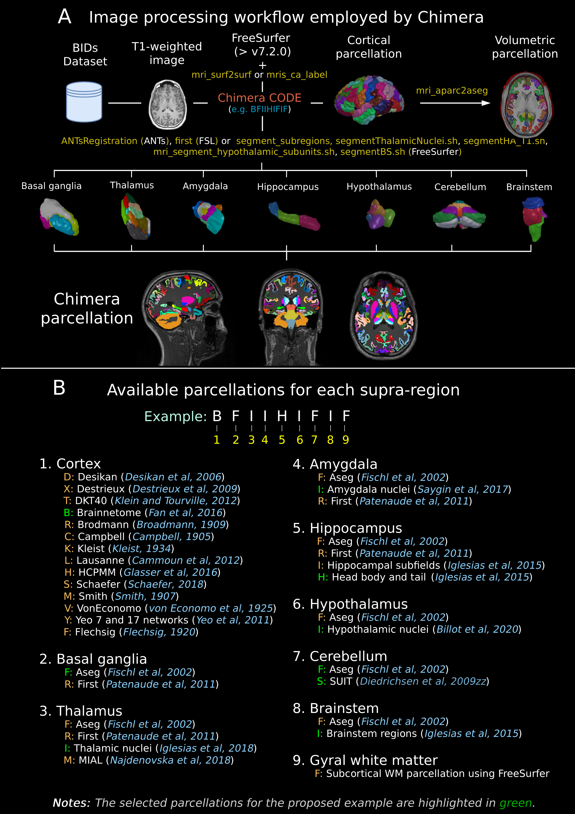
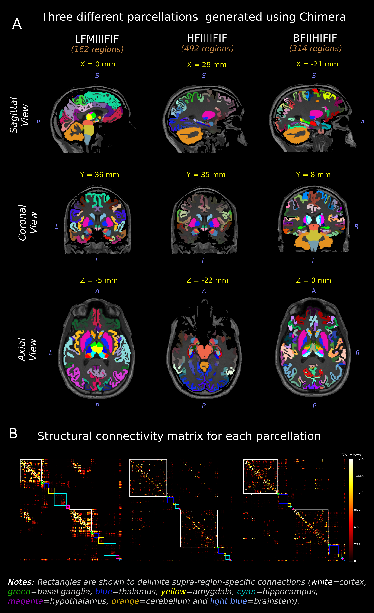

Welcome to CHIMERA: An open source framework for combining multiple parcellations's documentation!
======================================================================================================

Creating multi-source parcellations of the human brain is a fundamental task at several steps of the MRI analysis research workflow. **Chimera** facilitates this otherwise difficult operation with an intuitive and flexible interface for humans and machines, thereby assisting in the construction of sophisticated and more reliable processing pipelines.

Parcellations Fusion
=====================

Chimera defines ten different supra-regions (cortex, basal ganglia, thalamus, amygdala, hippocampus, hypothalamus, cerebellum, brainstem, gyral white matter, and white-matter). Basal ganglia includes only the regions that are not labeled as supra-regions. Subdivisions in each supra-region will be populated with the parcellation information of a single source. The available parcellation sources per supra-region, as well as one corresponding parcellation name, and a one-character unique identifier are configured in a JSON (JavaScript Object Notation) file.

**Chimera code**: A sequence of ten one-character identifiers (one per each supra-region) unambiguously denotes a single instance of combined parcellation (Figure 1B). Given the sequence of ten identifier characters, Chimera selects the atlas and/or applies the corresponding methodology to obtain the parcellation for each supra-region. These supra-region-specific parcellations are finally integrated to obtain the combined volumetric parcellation for each input subject, as well as its corresponding tab-separated values table of labels, region names, and rendering colors for visualization.

Chimera uses FreeSurfer to map cortical templates from fsaverage to individual space. It also applies different methods to obtain the hippocampal subfields and brainstem parcellations as well as the thalamic, amygdala and hypothalamic nuclei segmentations. FIRST and ANTs are also used for segmenting subcortical structures and thalamic nuclei respectively.

   
   **Figure 1**: Overview of the CHIMERA parcellation framework showing the different supra-regions and their corresponding parcellation methods.

   
   **Figure 2**: Examples of combined parcellations generated using different Chimera codes.

.. toctree::
   :maxdepth: 2
   :caption: Contents:

   readme
   installation
   quickstart
   usage
   tutorials
   api
   modules
   contributing
   authors
   history

Indices and tables
==================
* :ref:`genindex`
* :ref:`modindex`
* :ref:`search`
